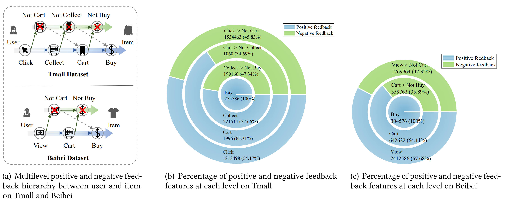
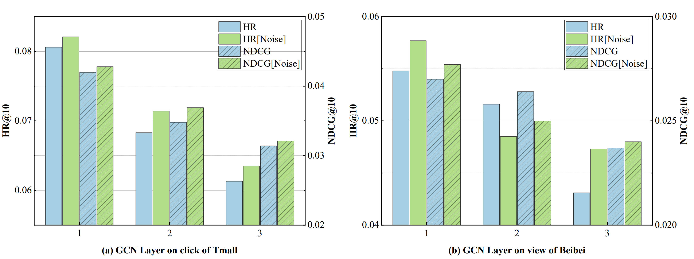
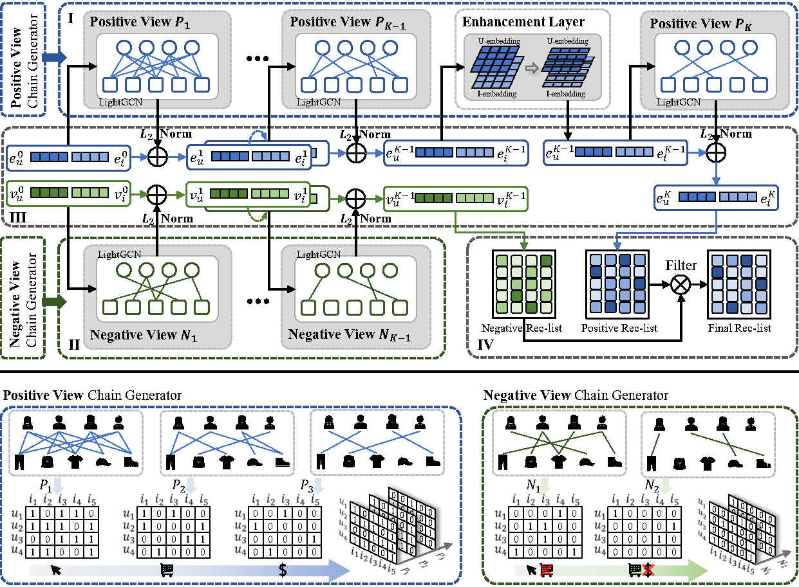
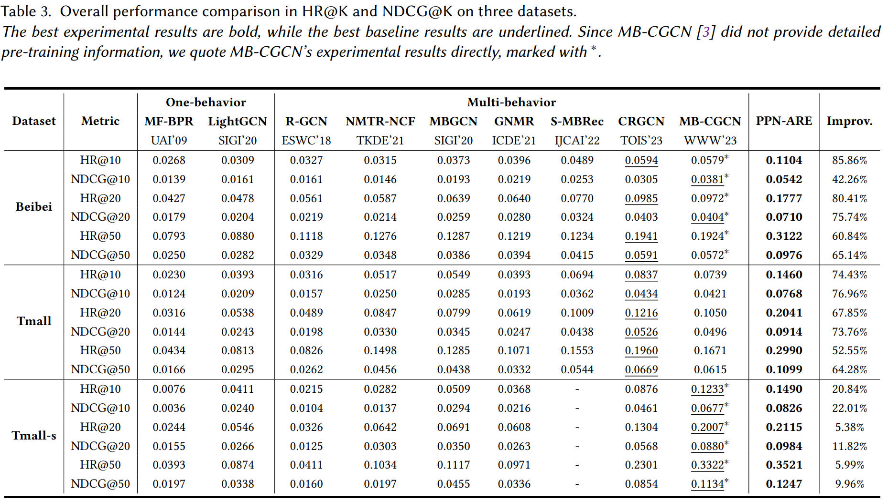
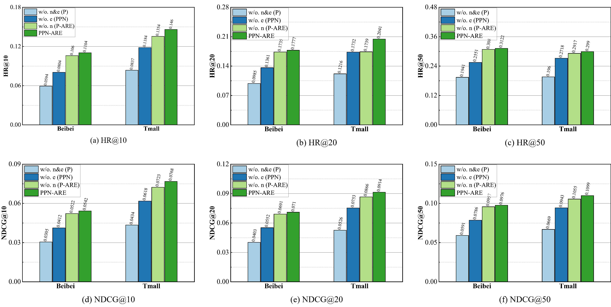

  <h1><b> PPN-ARE: Representation-Enhanced Cascading Multi-Level Interest Learning   
    for Multi-Behavior Recommendation </b></h1>

#  Introduction  

🏆 **PPN-RAE** , as a parallel positive-negative interest extraction method that leverages cascading multi-behavioral views to learn the multi-level interests of users, is proposed to **achieve consistent SOTA performance in the corresponding multi-behavioral recommendation tasks.**  
**The manuscript has been submitted to TOIS.**

🌟**Observation 1: Neglected Massive Multi-level Negative Feedback**   
As shown in Figure (a) below, under the cascade structure, each auxiliary behavior in the Tmall and Bebe datasets corresponds to a positive feedback signal feature. In addition, we quantify the feedback signal characteristics of each cascade, as shown in Figs. (b)(c) below, on average, negative feedback accounts for nearly 40% of the total amount of feedback signals in each cascade and far exceeds the number of target interactions.

🌟**Observation 2: Problem Passing in Cascade Structures**   
The learning effect of upstream behaviors greatly influences the learning of preferences for downstream target behaviors and ultimately shapes the overall recommendation effect, while the importance of target behaviors is not fully appreciated in the cascade structure.

#  Overall Architecture

The architecture of the proposed PPN-ARE, mainly consists of four modules: (I) Positive Residual Block Sequence, (II) Negative Residual Block Sequence, (III)Embeddings parallel cascade, and (IV) Target behavior prediction and recommendation. Positive View Chain Generator and Negative View Chain Generator generate feature views for (I) Positive Residual Block Sequence, and (II) Negative Residual Block Sequence respectively.

  

#  Getting Started  

first please check that the environment contains the packages in requirements.txt.

You can see the [Documentation](https://github.com/rusty1s/pytorch_scatter) when installing _**torch_scatter**_ and _**torch_sparse**_.   

Before running, you need to create the directories **log** and **check_point** in the root directory.

Taking the Tmall dataset as an example, after executing the method of generating data files in *data_process.py*, you can run Tmall dataset with:

`python main.py --data_name tmall`  

#  Main Results
We conducted a number of experiments to evaluate the performance of PPN-ARE, including overall performance comparisons with nine models, as well as targeted ablation experiments.  
**🏆 PPN-ARE achieves state-of-the-art performance**   and ablation experiments validate each component.  
##  Overall experiment

  

##  Ablation experiment  

  

##  Acknowledgement 

We appreciate the following GitHub repos a lot for their valuable code and efforts.  
- CRGCN (https://github.com/MingshiYan/CRGCN)  
- MB-CGCN (https://github.com/SS-00-SS/MBCGCN)  

##  Contact  

If you have any questions or want to use the code, feel free to contact:
* Hu Liu (liuhucqu@gmail.com)
